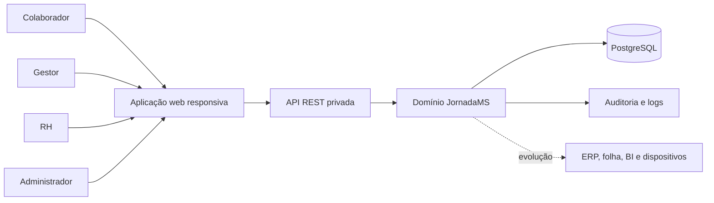
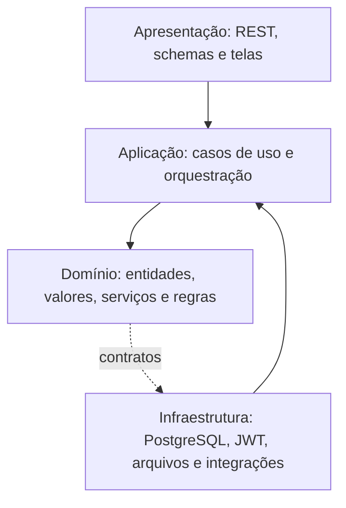
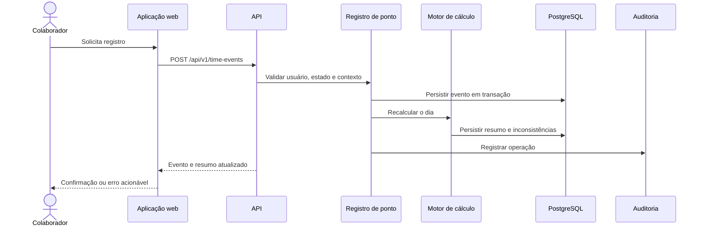
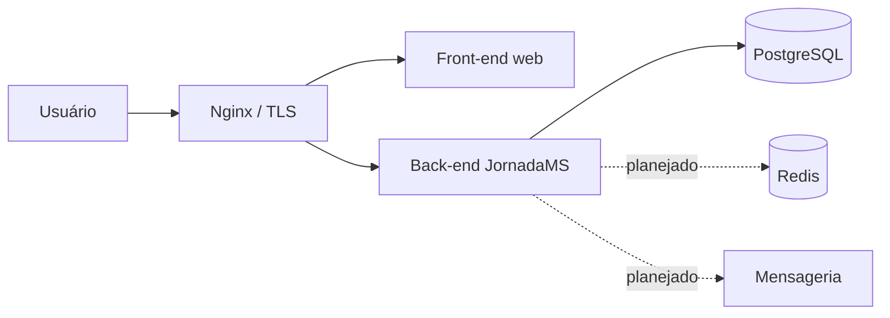

# Arquitetura do JornadaMS

## 1. Objetivo e escopo

Este documento descreve a arquitetura de referência do JornadaMS para o MVP. Ele define os limites dos módulos, a comunicação entre camadas, os fluxos principais, os requisitos operacionais e os pontos de evolução. A decisão arquitetural principal está registrada no [ADR-001](adr/ADR-001-modular-monolith.md).

## 2. Contexto

O sistema centraliza o registro da jornada e disponibiliza informações para quatro perfis principais: colaborador, gestor operacional, RH e administrador. A aplicação web consome uma API REST privada, que aplica as regras de negócio e persiste os dados no PostgreSQL.

## 3. Princípios

- **Simplicidade primeiro:** começar com um monólito modular e extrair serviços somente quando houver evidência operacional.
- **Domínio protegido:** regras de jornada não dependem de FastAPI, banco ou componentes de UI.
- **Baixo acoplamento:** módulos comunicam-se por casos de uso e contratos explícitos.
- **Segurança por padrão:** autenticação, autorização, auditoria e proteção de dados fazem parte do desenho inicial.
- **Evolução incremental:** novas integrações e canais devem ser adicionados sem reescrever o núcleo da jornada.

## 4. Arquitetura lógica

O sistema segue uma organização em camadas por módulo:

### Camadas

| Camada | Responsabilidade | Não deve conter |
| --- | --- | --- |
| Apresentação | HTTP, validação de entrada, serialização e tratamento de erro | Regra de cálculo de jornada |
| Aplicação | Casos de uso, transações e coordenação de portas | SQL espalhado em controladores |
| Domínio | Regras, entidades, serviços e eventos de negócio | Dependência direta de framework |
| Infraestrutura | Persistência, autenticação, exportação e integrações | Decisões de negócio não documentadas |

## 5. Módulos do monólito

| Módulo | Responsabilidades principais | Dependências permitidas |
| --- | --- | --- |
| Identidade e acesso | Usuários, credenciais, sessões, papéis e permissões | Auditoria |
| Administração | Empresa, filial, departamento, cargo e parâmetros | Identidade |
| Colaboradores | Cadastro e vínculo organizacional | Administração, identidade |
| Jornada | Jornadas, horários, tolerâncias e escalas simples | Administração |
| Registro de ponto | Eventos de entrada, intervalo, retorno e saída | Colaboradores, jornada, auditoria |
| Cálculo | Horas trabalhadas, atrasos, extras, saldo e inconsistências | Registro, jornada |
| RH | Justificativas, ajustes e aprovações | Colaboradores, registro, cálculo, identidade |
| Relatórios | Consultas e exportações diário/semanal/mensal | Registro, cálculo, colaboradores |
| Analytics | Indicadores básicos do dashboard | Relatórios, cálculo |
| Auditoria | Registro imutável de operações críticas | Identidade |

Os módulos devem manter suas entidades e serviços internos encapsulados. Integrações entre módulos devem ocorrer por interfaces de aplicação, eventos de domínio ou consultas explicitamente definidas.

## 6. Fluxos principais

### Registro de ponto

### Ajuste administrativo

1. RH consulta a jornada e identifica uma inconsistência.
2. RH registra justificativa e solicita ajuste.
3. Um usuário autorizado aprova ou rejeita o ajuste.
4. O sistema preserva o evento original, grava a versão ajustada, recalcula o dia e registra a trilha de auditoria.

## 7. Persistência e consistência

- PostgreSQL é a fonte transacional dos registros de jornada.
- Registro de evento, atualização do resumo diário e auditoria devem ocorrer na mesma transação quando fizerem parte da mesma operação crítica.
- Valores de data/hora devem ser armazenados em UTC e apresentados no fuso configurado da organização.
- Identificadores devem ser gerados pelo sistema e ser estáveis; UUID é a referência recomendada.
- Consultas de relatório devem usar filtros por período, colaborador, departamento e filial.
- O modelo detalhado está em [database/model.md](../database/model.md).

## 8. Segurança

- JWT para autenticação da API, com expiração e renovação controladas.
- Senhas armazenadas somente com hash resistente a ataques de força bruta.
- RBAC aplicado no caso de uso e não apenas na interface.
- HTTPS/TLS em trânsito e gestão de segredos por variáveis de ambiente ou cofre.
- Auditoria de login, alterações de cadastro, ajustes, aprovações, exportações e mudanças de configuração.
- Minimização de dados pessoais, princípio do menor privilégio e tratamento compatível com a LGPD.
- Validação de entrada, proteção contra injeção, rate limiting para autenticação e revisão contra riscos do OWASP Top 10.

## 9. Operação e observabilidade

O MVP deve emitir logs estruturados com correlação por requisição e identificador de usuário. A evolução operacional deve incluir:

- health checks de aplicação e banco;
- métricas de latência, erro, volume de registros e falhas de cálculo;
- alertas para indisponibilidade e degradação;
- rastreamento distribuído quando integrações assíncronas forem adicionadas.

As metas iniciais são disponibilidade mínima de 99,5%, tempo médio de registro de até 3 segundos e tempo médio de resposta da API de até 300 ms, conforme os critérios da visão.

## 10. Implantação

O ambiente deve ser conteinerizado para manter paridade entre desenvolvimento, homologação e produção. A implantação de referência contém:

Docker Compose é suficiente para o início. Azure, AWS ou Google Cloud podem ser usados posteriormente sem alterar o domínio da aplicação.

## 11. Evolução

- **1.0:** monólito modular, PostgreSQL, API privada e web responsiva.
- **1.5:** integrações corporativas, Redis, notificações e aprovações ampliadas.
- **2.0:** observabilidade avançada, eventos, mobile e BI em tempo real.
- **3.0:** módulos de Workforce Management e eventual extração de serviços.

Microsserviços não são um requisito do MVP. A extração de um módulo deve ser precedida por medição de carga, fronteira de domínio estável, necessidade de escala independente e capacidade operacional para manter a distribuição.

## 12. Decisões pendentes

Antes da implementação definitiva, devem ser confirmados: estratégia de implantação inicial, provedor de identidade, política de retenção, RPO/RTO, regras para jornadas que atravessam a meia-noite, arredondamento e parâmetros trabalhistas aplicáveis.
