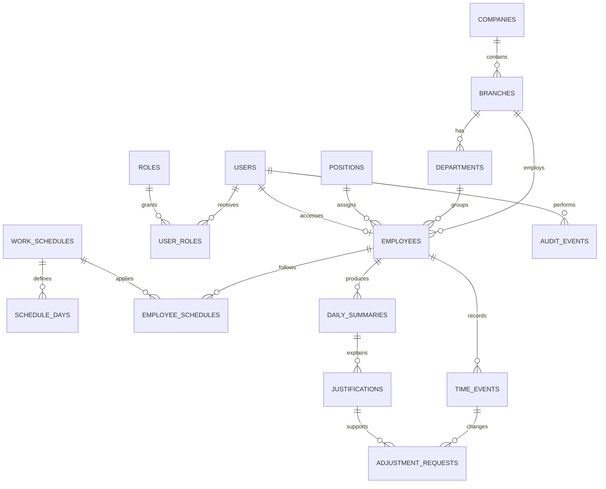

# Modelo de dados

## 1. Objetivo

Este modelo representa o núcleo transacional do MVP. Ele prioriza integridade dos registros, histórico de alterações e possibilidade de evolução para múltiplas filiais, integrações e regras de jornada mais complexas.

## 2. Convenções

- PostgreSQL como banco relacional.
- UUID como identificador primário recomendado.
- `created_at` e `updated_at` em UTC em todas as entidades mutáveis.
- Datas de negócio armazenadas com referência explícita de fuso/filial.
- Status representado por valores controlados, preferencialmente enum ou tabela de domínio.
- Exclusão lógica para cadastros e registros que precisem permanecer auditáveis.
- Foreign keys e transações para proteger referências e cálculos.

## 3. Entidades principais

| Entidade | Finalidade | Campos essenciais |
| --- | --- | --- |
| `companies` | Empresa cadastrada no sistema | `id`, `name`, `document`, `status`, `timezone` |
| `branches` | Filial ou unidade operacional | `id`, `company_id`, `name`, `code`, `timezone`, `status` |
| `departments` | Departamento organizacional | `id`, `branch_id`, `name`, `status` |
| `positions` | Cargo do colaborador | `id`, `name`, `status` |
| `users` | Identidade de acesso | `id`, `email`, `password_hash`, `status`, `last_login_at` |
| `roles` | Papel de acesso | `id`, `name`, `description` |
| `user_roles` | Relação usuário/papel | `user_id`, `role_id`, `scope` |
| `employees` | Pessoa vinculada à jornada | `id`, `user_id`, `branch_id`, `department_id`, `position_id`, `name`, `identifier`, `status` |
| `work_schedules` | Jornada prevista | `id`, `name`, `timezone`, `tolerance`, `status` |
| `schedule_days` | Horários por dia da semana | `id`, `schedule_id`, `weekday`, `start_time`, `break_start`, `break_end`, `end_time` |
| `employee_schedules` | Vigência da jornada de um colaborador | `employee_id`, `schedule_id`, `starts_on`, `ends_on` |
| `time_events` | Marcações de ponto | `id`, `employee_id`, `event_type`, `occurred_at`, `source`, `created_by`, `idempotency_key` |
| `daily_summaries` | Resultado calculado por dia | `id`, `employee_id`, `work_date`, `scheduled_minutes`, `worked_minutes`, `overtime_minutes`, `delay_minutes`, `balance_minutes`, `status` |
| `justifications` | Motivo de ausência ou inconsistência | `id`, `employee_id`, `work_date`, `reason`, `status`, `created_by` |
| `adjustment_requests` | Proposta de alteração | `id`, `time_event_id`, `justification_id`, `old_value`, `new_value`, `status`, `requested_by`, `decided_by` |
| `audit_events` | Trilha imutável de operações | `id`, `actor_id`, `action`, `entity_type`, `entity_id`, `before_data`, `after_data`, `occurred_at`, `correlation_id` |

## 4. Relacionamentos

## 5. Integridade e índices

- `users.email` deve ser único de forma case-insensitive.
- `employees.identifier` deve ser único no escopo definido pela organização.
- `time_events(employee_id, occurred_at)` deve possuir índice para consultas cronológicas.
- `time_events(employee_id, idempotency_key)` deve impedir duplicidade quando a chave estiver presente.
- `daily_summaries(employee_id, work_date)` deve ser único.
- Índices de relatório devem cobrir período, filial, departamento e colaborador conforme volume observado.
- `adjustment_requests` deve referenciar o evento e a justificativa sem permitir apagar o histórico aprovado.
- Dados JSON de antes/depois em auditoria devem ser somente de acréscimo e protegidos por permissão.

## 6. Transações críticas

### Registro de ponto

1. Validar colaborador, jornada, sequência e idempotência.
2. Inserir `time_events`.
3. Recalcular `daily_summaries`.
4. Registrar `audit_events`.
5. Confirmar a transação.

Se qualquer etapa falhar, nenhuma parte da operação deve permanecer aplicada.

### Ajuste aprovado

1. Validar solicitação pendente e permissão.
2. Atualizar estado da solicitação.
3. Preservar o valor anterior e aplicar a versão autorizada.
4. Recalcular o resumo.
5. Registrar auditoria.

## 7. Privacidade e retenção

Dados pessoais devem ser coletados apenas para a finalidade de gestão de jornada, com acesso mínimo necessário. A política de retenção e descarte ainda precisa ser definida com RH/jurídico; até lá, nenhuma rotina automática de exclusão deve ser criada.

## 8. Escopo e evolução

Embora o MVP não ofereça isolamento multiempresa como produto SaaS, `companies` e `branches` são mantidas como entidades de cadastro e organização. O suporte efetivo a múltiplos clientes, segregação forte de tenant e regras específicas por empresa deve ser tratado em uma evolução própria.

O arquivo [erd.drawio](erd.drawio) contém o diagrama editável de referência.
