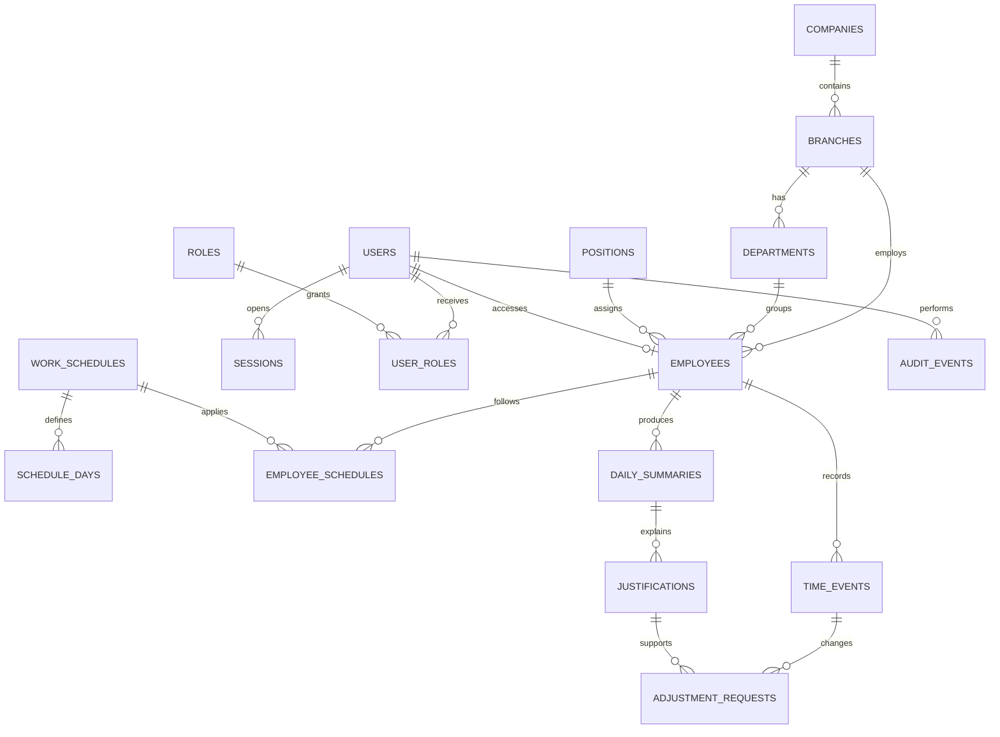

# Modelo de dados

## 1. Objetivo

Este modelo representa o núcleo transacional do MVP. Ele prioriza integridade dos registros, histórico de alterações e possibilidade de evolução para múltiplas filiais, integrações e regras de jornada mais complexas.

## 2. Convenções

- PostgreSQL como banco relacional.
- UUID como identificador primário recomendado.
- `created_at` e `updated_at` em UTC em todas as entidades mutáveis.
- Datas de negócio armazenadas com referência explícita de fuso/filial.
- Status representado por valores controlados, preferencialmente enum ou tabela de domínio.
- Exclusão lógica para cadastros e registros que precisem permanecer auditáveis.
- Foreign keys e transações para proteger referências e cálculos.
- `companies.cnpj` representa o CNPJ normalizado no MVP; CPF não é aceito como documento empresarial.
- `employees.registration_code` é a matrícula interna, única no escopo da organização por meio de `company_id`; `punch_identifier` é o identificador visual/emoji usado no registro. Nenhum dos dois representa CPF.
- Um colaborador pode existir sem usuário de acesso; `user_id` é opcional e único quando informado.
- `work_schedules.tolerance_minutes` é inteiro em minutos e não é aplicado no MVP-1.

## 3. Entidades principais

A migration `0001_foundation` cria a fundação transacional do MVP-1: organização, identidade, colaboradores, jornadas, marcações, resumos diários e auditoria. `justifications` e `adjustment_requests` permanecem modeladas como evolução do MVP-2 e serão adicionadas em migrations posteriores; o diagrama antecipa esses relacionamentos.

| Entidade | Finalidade | Campos essenciais |
| --- | --- | --- |
| `companies` | Empresa cadastrada no sistema | `id`, `name`, `cnpj`, `status`, `default_timezone` |
| `branches` | Filial ou unidade operacional | `id`, `company_id`, `name`, `code`, `timezone`, `status` |
| `departments` | Departamento organizacional | `id`, `branch_id`, `name`, `status` |
| `positions` | Cargo do colaborador | `id`, `name`, `status` |
| `users` | Identidade de acesso | `id`, `email`, `password_hash`, `status`, `last_login_at` |
| `sessions` | Sessão e refresh token revogável | `id`, `user_id`, `token_hash`, `expires_at`, `revoked_at`, `last_used_at`, `ip_address`, `user_agent` |
| `roles` | Papel de acesso | `id`, `name`, `description` |
| `user_roles` | Relação usuário/papel | `user_id`, `role_id`, `scope` |
| `employees` | Pessoa vinculada à jornada | `id`, `user_id` opcional, `company_id`, `branch_id`, `department_id`, `position_id`, `name`, `registration_code`, `punch_identifier`, `status` |
| `work_schedules` | Jornada prevista | `id`, `name`, `tolerance_minutes`, `interval_count`, `same_day_only`, `status` |
| `schedule_days` | Horários por dia da semana | `id`, `schedule_id`, `weekday`, `start_time`, `break_start`, `break_end`, `end_time` |
| `employee_schedules` | Vigência da jornada de um colaborador | `employee_id`, `schedule_id`, `starts_on`, `ends_on` |
| `time_events` | Marcações de ponto | `id`, `employee_id`, `work_date`, `event_type`, `occurred_at`, `timezone`, `source`, `created_by`, `correlation_id`, `idempotency_key` |
| `daily_summaries` | Resultado calculado por dia | `id`, `employee_id`, `work_date`, `scheduled_minutes`, `worked_minutes`, `overtime_minutes`, `delay_minutes`, `balance_minutes`, `status` |
| `justifications` | Motivo de ausência ou inconsistência | `id`, `employee_id`, `work_date`, `reason`, `status`, `created_by` |
| `adjustment_requests` | Proposta de alteração | `id`, `time_event_id`, `justification_id`, `old_value`, `new_value`, `status`, `requested_by`, `decided_by`, `decided_at`, `decision_reason` |
| `audit_events` | Trilha imutável de operações | `id`, `actor_id` lógico, `action`, `entity_type`, `entity_id`, `before_data`, `after_data`, `result`, `occurred_at`, `correlation_id`, `ip_address`, `user_agent` |

## 4. Relacionamentos

## 5. Integridade e índices

- `users.email` deve ser único de forma case-insensitive.
- `companies.cnpj` deve ser único e armazenado sem pontuação.
- `employees.registration_code` deve ser único no escopo da organização (`company_id`); `punch_identifier` deve ser único no escopo definido para o registro.
- `employees.user_id` é nullable e unique quando informado.
- `time_events(employee_id, work_date, occurred_at)` deve possuir índice para consultas cronológicas.
- `time_events(employee_id, idempotency_key)` deve impedir duplicidade quando a chave estiver presente.
- `sessions.token_hash` deve ser único; tokens em texto puro nunca são persistidos.
- `daily_summaries(employee_id, work_date)` deve ser único.
- Índices de relatório devem cobrir período, filial, departamento e colaborador conforme volume observado.
- `adjustment_requests` deve referenciar o evento e a justificativa sem permitir apagar o histórico aprovado.
- Dados JSON de antes/depois em auditoria devem ser somente de acréscimo e protegidos por permissão.

### Campos de auditoria e mascaramento

`audit_events.result` deve indicar `SUCCESS`, `FAILURE` ou `DENIED`. `ip_address` e `user_agent` são metadados operacionais e devem seguir a política de retenção. `before_data` e `after_data` não podem conter senha, token, hash de senha ou dados pessoais não necessários; campos sensíveis devem ser mascarados antes da gravação.

## 6. Transações críticas

### Registro de ponto

1. Validar colaborador, jornada e chave de idempotência.
2. Iniciar transação e bloquear o resumo por `employee_id + work_date` com `SELECT ... FOR UPDATE` ou advisory lock equivalente.
3. Revalidar a sequência dentro do bloqueio.
4. Inserir `time_events`.
5. Recalcular `daily_summaries`.
6. Registrar `audit_events`.
7. Confirmar a transação.

Se qualquer etapa falhar, nenhuma parte da operação deve permanecer aplicada.

### Idempotência

- A primeira requisição com uma chave válida persiste o evento e associa o resultado à chave.
- Reenvio com a mesma chave e payload equivalente retorna o resultado original, sem novo evento.
- Reenvio com a mesma chave e payload diferente retorna `409 Conflict`.
- A chave deve ser limitada ao recurso e ao colaborador; não deve ser reutilizada para outra marcação.

### Ajuste aprovado

1. Validar solicitação pendente e permissão.
2. Atualizar estado da solicitação.
3. Preservar o valor anterior e aplicar a versão autorizada.
4. Recalcular o resumo.
5. Registrar auditoria.

## 7. Privacidade e retenção

Dados pessoais devem ser coletados apenas para a finalidade de gestão de jornada, com acesso mínimo necessário. A política de retenção e descarte ainda precisa ser definida com RH/jurídico; até lá, nenhuma rotina automática de exclusão deve ser criada.

## 8. Sessões

O acesso usa JWT curto para chamadas da API e refresh token opaco, rotativo e persistido somente como hash em `sessions`. Logout revoga a sessão atual. Renovação deve invalidar o refresh token anterior e criar um novo registro ou versão da sessão. Sessões expiradas podem ser limpas por rotina operacional após a definição da política de retenção.

## 9. Escopo e evolução

Embora o MVP não ofereça isolamento multiempresa como produto SaaS, `companies` e `branches` são mantidas como entidades de cadastro e organização. O suporte efetivo a múltiplos clientes, segregação forte de tenant e regras específicas por empresa deve ser tratado em uma evolução própria.

O arquivo [erd.drawio](erd.drawio) contém o diagrama editável de referência.
